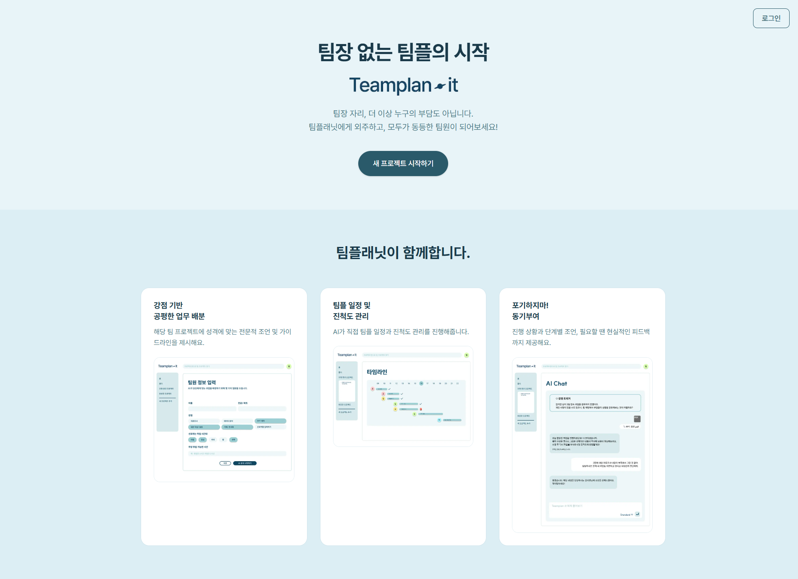
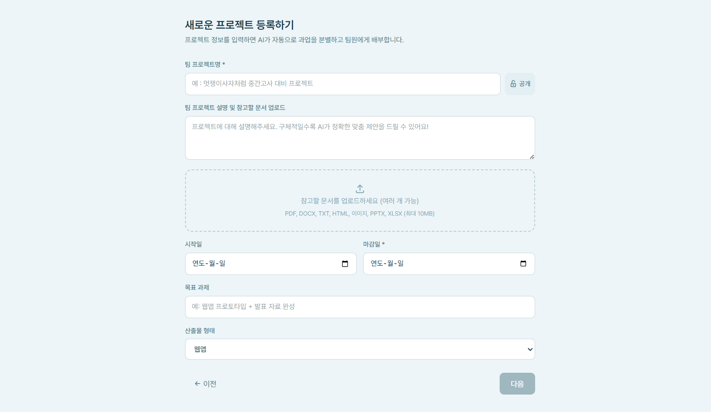
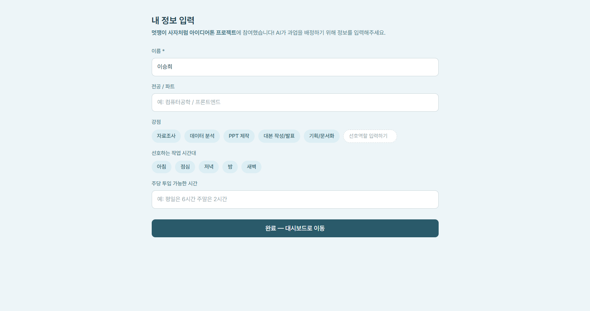
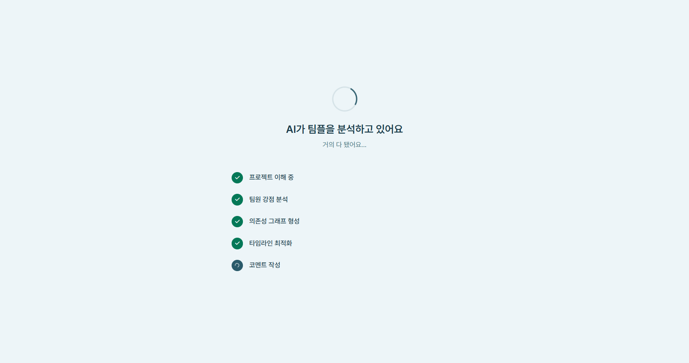
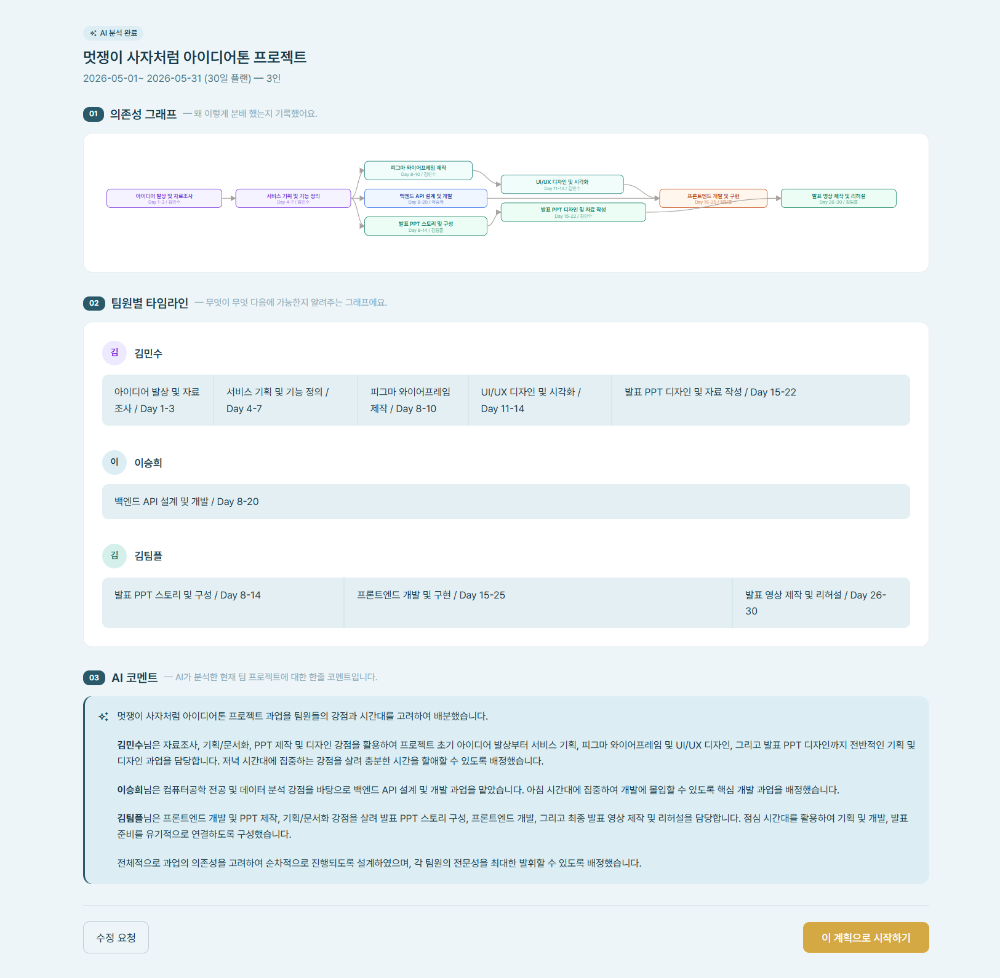
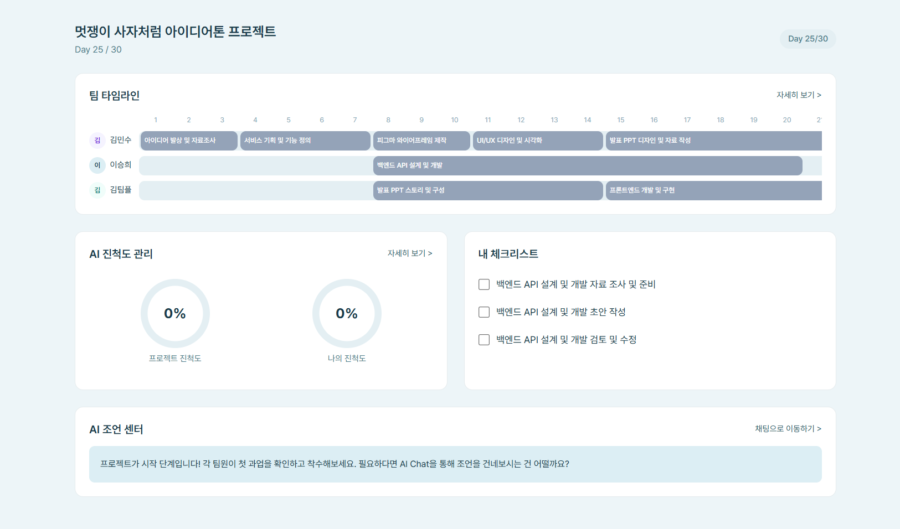
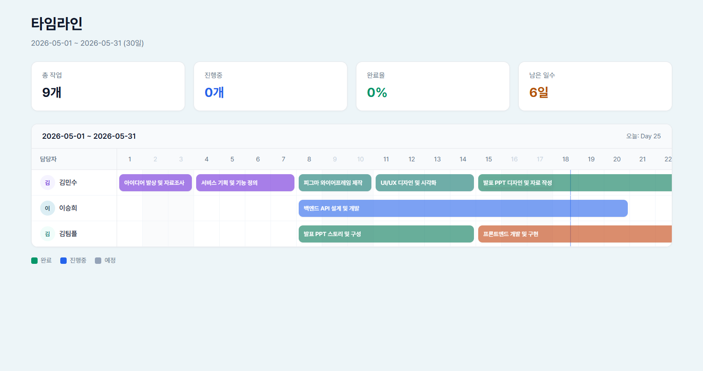
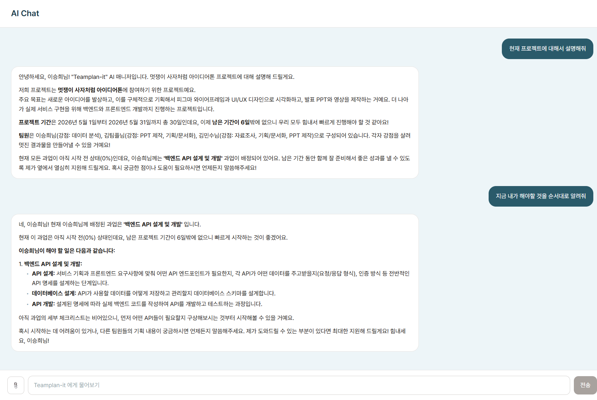
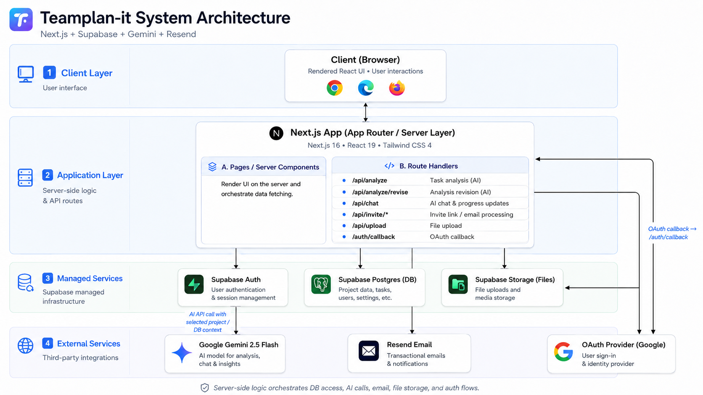
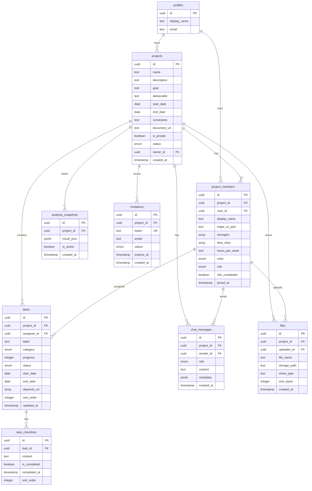

<div align="center">


# Teamplan-it

### 팀장 없는 팀플의 시작

AI가 팀장 역할을 대신하여, 모든 팀원이 동등하게 협업할 수 있는 팀 프로젝트 관리 서비스

[](https://www.teamplanit.site/)
[](https://nextjs.org/)
[](https://supabase.com/)
[](https://ai.google.dev/)

[서비스 바로가기](https://www.teamplanit.site/) · [멋쟁이사자처럼 아이디어톤 정보](https://likelion.community/competitions/ideathon/ideathon-1st)

</div>

---

## 목차

- [소개](#소개)
- [주요 기능](#주요-기능)
- [스크린샷](#스크린샷)
- [기술 스택](#기술-스택)
- [시스템 아키텍처](#시스템-아키텍처)
- [데이터 모델](#데이터-모델-erd)
- [AI 파이프라인](#ai-파이프라인)
- [시작하기](#시작하기)
- [팀원](#팀원)

## 소개

**Teamplan-it**은 멋쟁이사자처럼 아이디어톤에서 탄생한 서비스입니다.

대학교 팀플에서 매번 반복되는 문제 — *"누가 팀장 할 거야?"*, *"일정은 어떻게 짜지?"*, *"누가 뭘 맡아?"* — 를 AI로 해결합니다. 프로젝트 정보와 팀원의 강점만 입력하면, AI가 과업을 분해하고, 의존성을 분석하고, 팀원별 최적 일정을 자동으로 배정합니다.

더 이상 팀장이라는 부담 없이, 모두가 동등한 팀원으로 프로젝트에 집중할 수 있습니다.

## 주요 기능

### AI 과업 분석 및 자동 배정
프로젝트 설명과 팀원의 강점, 가용 시간을 기반으로 AI가 과업을 분해하고 최적의 담당자를 배정합니다. 의존성 그래프를 생성하여 작업 순서를 자동으로 설계합니다.

### 팀 타임라인 (Gantt 차트)
팀원별 작업 일정을 한눈에 시각화합니다. 총 작업 수, 진행 상황, 완료율, 남은 일수를 실시간으로 확인할 수 있습니다.

### AI 채팅 코칭
AI 매니저가 각 팀원에게 맞춤형 업무 안내와 동기부여를 제공합니다. 채팅으로 진행 상황을 보고하면 진척도가 자동으로 업데이트됩니다.

### 대시보드 & 진척도 관리
프로젝트 진척도, 내 체크리스트, AI 조언을 한 화면에서 확인합니다. 팀 전체와 개인의 진행률을 링 차트로 직관적으로 보여줍니다.

### 팀원 초대 & 온보딩
초대 링크 또는 이메일로 팀원을 초대합니다. 각 팀원이 자신의 강점, 선호 시간대, 가용 시간을 직접 입력하면 AI 분석에 반영됩니다.

## 스크린샷

### 랜딩 페이지


### 프로젝트 생성


### 팀원 정보 입력


### AI 분석 중


### AI 분석 결과


### 대시보드


### 타임라인 (Gantt 차트)


### AI 채팅


## 기술 스택

| 분류 | 기술 |
|------|------|
| **프레임워크** | Next.js 16 (App Router), React 19 |
| **언어** | TypeScript |
| **스타일링** | Tailwind CSS 4 |
| **데이터베이스** | Supabase (PostgreSQL) |
| **인증** | Supabase Auth |
| **파일 저장소** | Supabase Storage |
| **AI** | Google Gemini 2.5 Flash |
| **이메일** | Resend |
| **배포** | Vercel |

## 시스템 아키텍처



> Client → Next.js API Routes → 외부 서비스 3계층 구조. Supabase가 Auth, DB, Storage를 모두 담당하며, Gemini API는 DB에서 프로젝트·팀원 데이터를 읽어 과업 분석에 활용합니다.

## 데이터 모델 (ERD)

총 **9개 테이블** 설계. 프로젝트-팀원-과업 중심의 정규화된 스키마.



## AI 파이프라인

### 과업 분석 (`/api/analyze`)

프로젝트 정보와 팀원 데이터를 Gemini API에 전달하여 과업을 자동 분해·배정합니다.

**입력 데이터:**
- 프로젝트 기본정보 (이름, 설명, 목표, 산출물, 기간, 제약사항)
- 팀원 정보 (이름, 전공, 강점, 선호 시간대, 주당 가용시간)
- 첨부 문서 (PDF, 이미지 등 — Base64 인코딩하여 Gemini에 전달)

**출력 구조 (JSON Schema 강제):**
```json
{
  "nodes": [
    { "id": "task_1", "label": "API 설계", "day": "Day 4-7",
      "assignee": "이승희", "category": "backend", "dependsOn": ["task_0"] }
  ],
  "timelines": [
    { "memberName": "이승희", "bars": [
        { "label": "API 설계", "startPercent": 10, "widthPercent": 20 }
    ]}
  ],
  "checklists": { "task_1": ["요구사항 분석", "API 명세 작성", "리뷰"] },
  "comment": "각 팀원의 강점과 시간대를 고려하여 배정했습니다..."
}
```

**안정성 확보:**
- `responseSchema`로 JSON 구조 강제 (Structured Output)
- 응답 실패 시 최대 3회 재시도 (온도 0.7 → 0.3 하향)
- 불완전한 JSON 자동 복구 (미종료 문자열, 닫히지 않은 괄호 처리)
- IP당 분당 5회 Rate Limiting

### AI 채팅 코칭 (`/api/chat`)

팀원과의 대화에서 진행 상황을 자동으로 감지하고 업데이트합니다.

**자동 진행률 업데이트:** AI 응답에 `[PROGRESS_UPDATE]` 태그가 포함되면 해당 과업의 진행률과 상태를 자동 변경 (todo → in_progress → done)

**자동 체크리스트 완료:** `[CHECKLIST_UPDATE]` 태그로 체크리스트 항목을 자동 완료 처리하고, 완료 비율에 따라 과업 진행률을 재계산

**감정 트리거 감지:** 3일 이상 진행률 0%인 과업이 있으면 AI가 자동으로 감지하여 팀원에게 부드러운 격려와 구체적인 시작 가이드를 제공

## 시작하기

### 사전 요구사항

- Node.js 18+
- npm

### 설치 및 실행

```bash
# 의존성 설치
npm install

# 환경변수 설정
cp .env.example .env.local
```

`.env.local`에 다음 환경변수를 설정합니다:

```env
GEMINI_API_KEY=            # Google Gemini API 키
NEXT_PUBLIC_SUPABASE_URL=  # Supabase 프로젝트 URL
NEXT_PUBLIC_SUPABASE_ANON_KEY=  # Supabase 익명 키
SUPABASE_SERVICE_ROLE_KEY= # Supabase 서비스 키
RESEND_API_KEY=            # Resend 이메일 API 키
```

```bash
# 개발 서버 실행
npm run dev
```

[http://localhost:3000](http://localhost:3000)에서 확인할 수 있습니다.

## 팀원

**팀 팀플래닛 (Teamplanit)** | 멋쟁이사자처럼 아이디어톤

| 이름 | 역할 |
|------|------|
| 이승희 | Backend |
| 전민경 | Backend |
| 김지연 | Frontend |
| 김지유 | 기획 |
| 조용현 | 디자인 |
| 임상현 | 멘토 |
